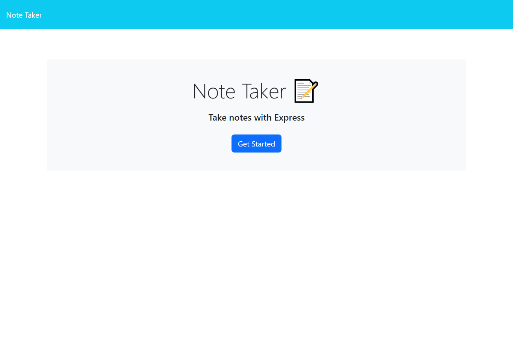
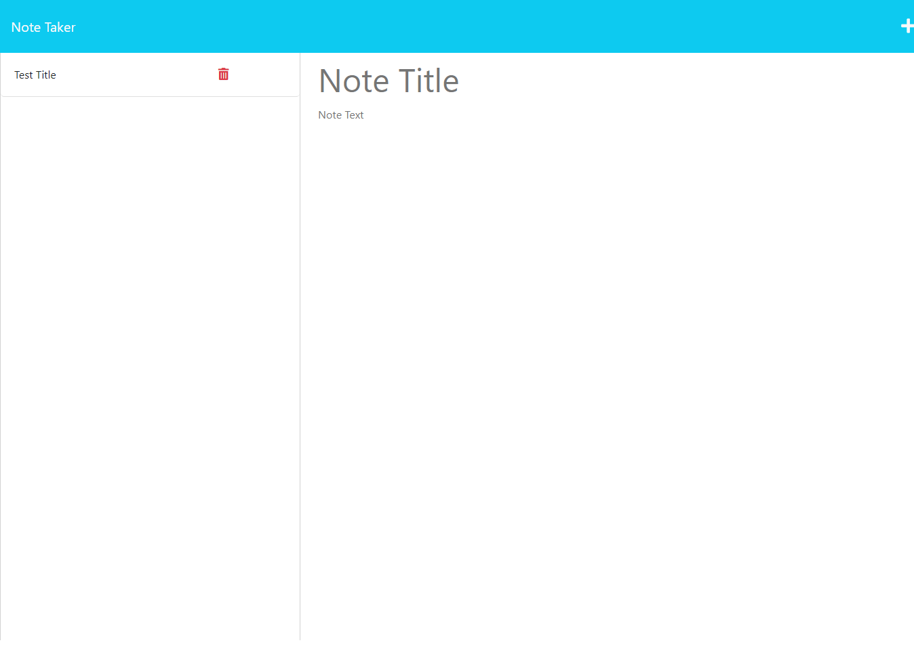
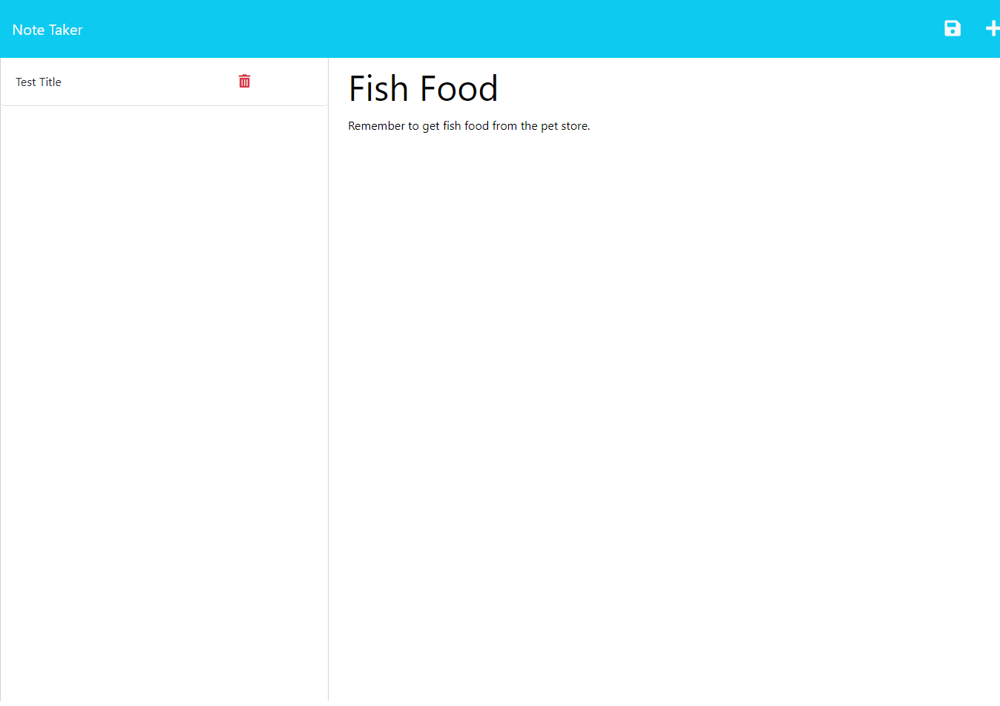
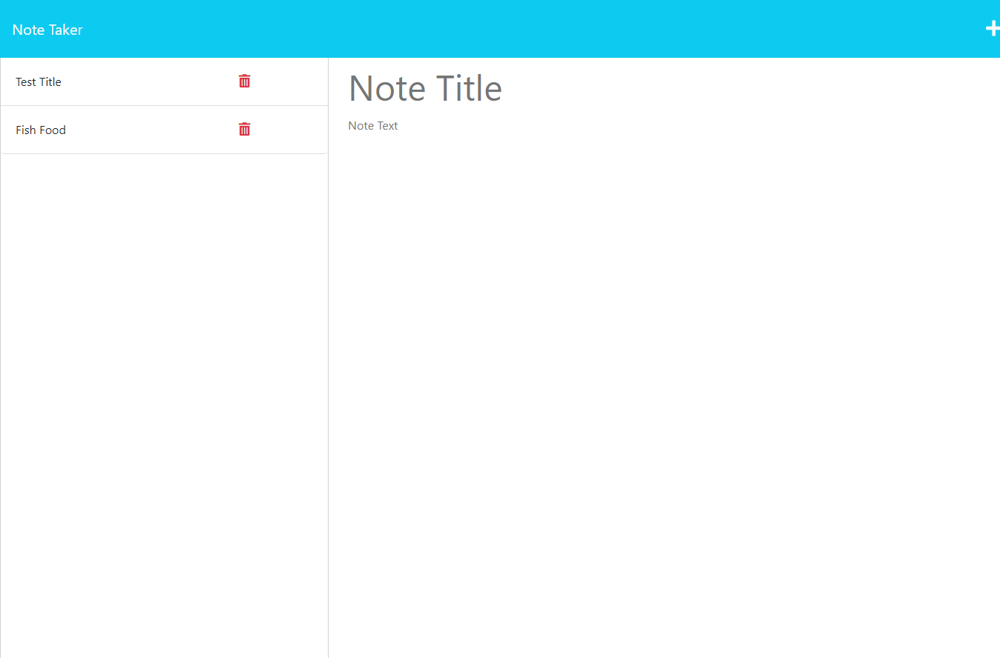

# express.js-note-taker

## Description

In this project, we utilized Express.js, which is the standard server framework or Node.js. It was used to build a webapp with backend functionality and built in Fetch API package.

## Installation

- [Node.js](https://nodejs.org/en) (from v16 to v18) is required to run this application
- Express.js is also required and can be installed by typing `npm install` into the terminal of the project folder

## Usage

- Visit the live app [here](https://express-js-note-taker-project.herokuapp.com/)
- Press the `Get Started` button
- Enter your `Note Title` and `Note Text`
- Press the floppy disk icon on the top right on the screen

## License

Refer to license in the repository